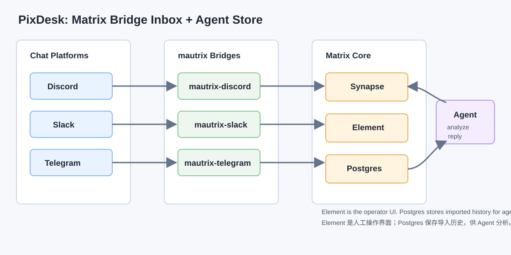
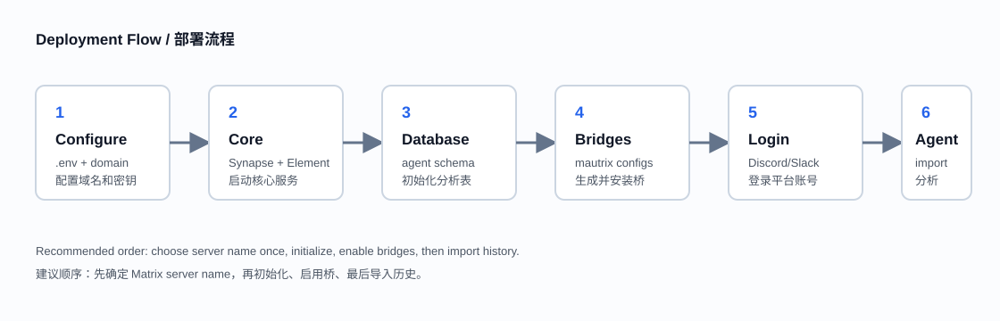
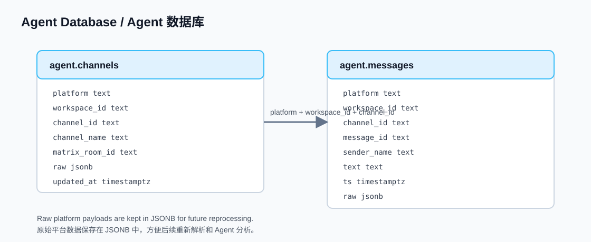

# PixDesk

[中文版](README.zh-CN.md)

PixDesk is a deployable Matrix + mautrix bridge stack for aggregating Discord, Slack, and Telegram conversations into one Element inbox, with a Postgres schema for agent-side history analysis.



## What It Solves

- Aggregate Discord, Slack, and Telegram into one Matrix/Element inbox.
- Use Matrix as the common realtime message bus.
- Store imported history in Postgres for search, analytics, and AI agents.
- Send replies through Matrix and let bridges relay them back to the source platform.

## Architecture

The system has four layers:

1. Chat platforms: Discord, Slack, Telegram.
2. mautrix bridges: one bridge per platform.
3. Matrix core: Synapse + Element.
4. Agent storage: Postgres `agent.channels` and `agent.messages`.

## Deployment Flow



Recommended order:

1. Choose `MATRIX_SERVER_NAME` once.
2. Initialize Synapse and start core services.
3. Create the Matrix admin user.
4. Initialize the agent database schema.
5. Generate and install bridge registrations.
6. Log in to platform bridges from Element.
7. Import historical messages into Postgres.

## Requirements

- Docker Engine or Docker Desktop with Compose v2
- `make`, `bash`, `python3`
- A domain and HTTPS reverse proxy for cloud deployment
- Platform credentials or login tokens for Discord, Slack, and Telegram
- Optional: `qrencode` for Discord QR helper

## Quick Start

```bash
git clone https://github.com/KoujiMinamoto/pixdesk.git
cd pixdesk
cp .env.example .env
```

Edit `.env` before first initialization:

```env
MATRIX_SERVER_NAME=matrix.example.com
MATRIX_PUBLIC_BASEURL=https://matrix.example.com/
POSTGRES_PASSWORD=replace-with-strong-password
SYNAPSE_REGISTRATION_SHARED_SECRET=replace-with-strong-secret
```

Start the core stack:

```bash
make init
make start-core
make create-admin MX_USER=admin MX_PASS='replace-with-admin-password'
make init-agent-db
```

Open Element:

```text
http://localhost:8080
```

## Bridge Setup

Generate bridge configs and registrations:

```bash
make bridge-init
```

Edit generated configs:

```text
data/mautrix-discord/config.yaml
data/mautrix-slack/config.yaml
data/mautrix-telegram/config.yaml
```

Install registrations and start bridges:

```bash
make install-registrations
make restart-synapse
make start-bridges
```

In Element, message the bridge bots:

```text
@discordbot:<server_name>
@slackbot:<server_name>
@telegrambot:<server_name>
```

Send `help` to each bot and follow login instructions.

## Discord Setup

Discord user-token login was validated in this project. QR login can be blocked by Discord CAPTCHA, which mautrix-discord cannot solve.

To show all existing Discord DMs in Element, raise the startup private channel limit:

```yaml
bridge:
  startup_private_channel_create_limit: 150
```

Restart the bridge:

```bash
docker compose --profile bridges restart mautrix-discord
```

To backfill newly created Discord rooms:

```yaml
bridge:
  backfill:
    forward_limits:
      initial:
        dm: 100
        channel: 200
        thread: 50
      missed:
        dm: 100
        channel: 200
        thread: 50
```

If some group DMs have blank names, set the Matrix room name from Discord recipients. The rooms are valid even when Discord returns an empty channel name.

If images, GIFs, or Tenor videos fail with `connect: connection refused`, check DNS from inside the `mautrix-discord` container. The Compose file includes validated `extra_hosts` pins for Discord media domains, but those IPs may need updating over time.

If Element shows `Failed to bridge media` or cannot open `mxc://` images, keep Synapse media compatible with legacy Element media endpoints:

```yaml
enable_authenticated_media: false
```

For an existing deployment that already stored authenticated local media, update old rows once:

```sql
update local_media_repository
set authenticated = false
where authenticated = true;
```

## Slack Setup

mautrix-slack supports token login. For workspaces where OAuth app setup is not available, token login may be the practical route.

Enable future room backfill:

```yaml
bridge:
  backfill:
    enabled: true
    max_initial_messages: 200
```

Slack history access depends on the logged-in token/cookie and workspace permissions.

## Agent Database



Initialize the schema:

```bash
make init-agent-db
```

Tables:

- `agent.channels`: one row per bridged/imported channel or DM
- `agent.messages`: imported message history with raw platform JSON

Connect to Postgres:

```bash
docker compose exec -T postgres psql -U synapse -d synapse
```

Example query:

```sql
select ts, sender_name, text
from agent.messages
where platform = 'discord'
  and channel_id = '1297732407725920266'
order by ts desc
limit 50;
```

## Import History

**Discord**

```bash
scripts/import-discord-history.py HyGo --limit 5000 --max-pages 50
scripts/import-discord-history.py 1297732407725920266 --limit 5000 --max-pages 50
```

Override paths when needed:

```bash
PIXDESK_PROJECT_DIR=/opt/pixdesk scripts/import-discord-history.py HyGo
PIXDESK_DISCORD_DB=/path/to/discord.db scripts/import-discord-history.py HyGo
```

**Slack**

```bash
scripts/import-slack-history.py internal-testfeishu --limit 1000 --max-pages 5
```

Override paths when needed:

```bash
PIXDESK_PROJECT_DIR=/opt/pixdesk scripts/import-slack-history.py internal-testfeishu
PIXDESK_SLACK_DB=/path/to/slack.db scripts/import-slack-history.py internal-testfeishu
```

## Cloud Deployment Checklist

1. Choose `MATRIX_SERVER_NAME` once. Changing it later is difficult.
2. Set strong `.env` secrets before `make init`.
3. Run core initialization and create admin user.
4. Put Synapse and Element behind HTTPS.
5. Update `MATRIX_PUBLIC_BASEURL` and `element/config.json`.
6. Generate bridge configs, edit credentials, install registrations.
7. Log in to bridge bots from Element.
8. Import history into Postgres for agent analysis.
9. Back up `data/` securely.

## Security

Do not commit:

- `.env`
- `data/`
- appservice registration tokens
- Synapse signing keys
- bridge SQLite databases
- Slack/Discord/Telegram tokens
- Postgres runtime files

This repository ignores those paths by default.

## Common Commands

```bash
make init
make start-core
make create-admin MX_USER=admin MX_PASS='strong-password'
make init-agent-db
make bridge-init
make install-registrations
make restart-synapse
make start-bridges
make logs
make down
```

`make clean` intentionally does not delete runtime data. To reset a lab manually:

```bash
rm -rf data
```

Only do this when you are sure you want to lose local Matrix, bridge, and database state.
