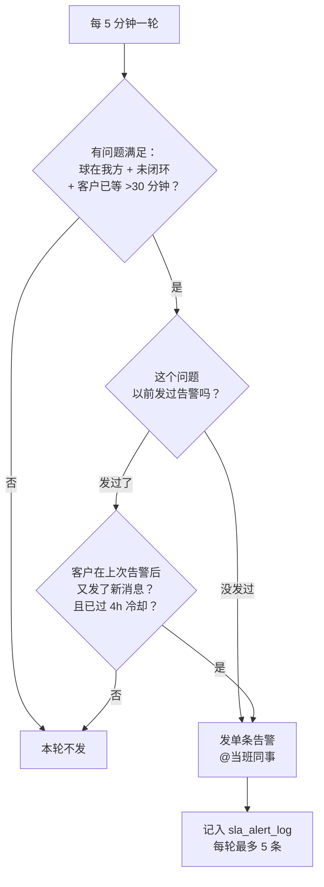
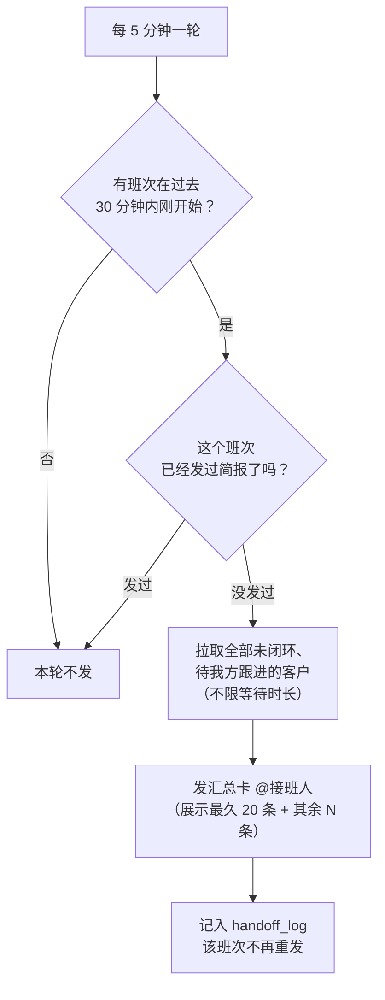

# PixDesk 主动告警链路说明

> 目标：**不用一直盯着看板，也不漏掉客户问题。** 系统自动发现"球在我方、还没回复"的客户，主动推送到飞书群并 @到人。

告警运行在腾讯云 `issue-engine` 里的一个后台线程（`_alert_loop`，每 5 分钟一轮），共两条链路：**SLA 实时告警** 和 **接班简报**。都发到群「dashboard迭代群（提bug需求）」，组长**蝙蝠侠暂不打扰（静默，不升级）**。

---

## 一、两条链路对比

| | ⏰ SLA 实时告警 | 🔄 接班简报 |
|---|---|---|
| **什么时候发** | 客户未回复 **超过 30 分钟** | **换班时**（班次开始后 30 分钟内的某一轮） |
| **@谁** | 当班同事 | **接班人**（刚上班的那位） |
| **发什么** | 单个超时问题 | **全部**未闭环、待我方跟进的客户（不限时长，完整交接） |
| **卡片** | 橙色 · 单条 | 蓝色 · 汇总（展示最久 20 条 + 其余 N 条） |
| **防重复** | `sla_alert_log`，同一问题 4 小时冷却 | `handoff_log`，每个班次只发一次 |
| **目的** | 紧急：这一个别拖了 | 交接：接班人一眼看清手上有哪些欠账 |

判定"球在我方"的口径：`nonclosure_reason = 'unanswered_customer'`（由闭环 Agent 判定，已排除 FYI／转发推文这类无需回复的消息），且问题未闭环（非 `closed_confirmed`／`dismissed`）、未被标记 `rejected`。

---

## 二、SLA 实时告警

### 触发流程

**关键设计**：已经提醒过的问题，只有当**客户又催了**（在我们上次提醒之后再次发言）才会重推——历史欠账不会被反复 @，但真正还在等的活跃对话也不会被漏掉。

### 卡片样子（橙色）

> **⏰ 超时未回复 · 1 天 3 小时**
>
> **snaphub** · 等待 1 天 3 小时 · `ISS-89762` · [打开对话](#)
> 　客户将 worker 数设为 0 想停止运行，但 worker 持续运行且 credits 仍被扣除，尚未确认修复。
> 　🔧 TODO：立即后台核查该账户 worker 状态与计费记录，24 小时内回复客户。
> ──────
> @当班同事 请跟进

---

## 三、接班简报

### 触发流程

排班来自 `agent.shift_roster`（排班表 × 轮班表展开成绝对时间段），花名→飞书 open_id 的映射在 `issue_tc.roster_identity`（温迪／火娃／绿巨人／迪卢克／阿杰）。

### 卡片样子（蓝色）

> **🔄 接班简报 · 白班2 · 共 39 条待跟进**
>
> @接班人 你已接班，以下客户仍未闭环、等待我方跟进：
> ──────
> **cafe24-llm-router-novita** · 等待 42 天 5 小时 · `ISS-90810` · [打开对话](#)
> 　客户 Sophie 请 Alex Yang 确认 Novita 与 MyRouter 在开放/闭源模型上的使用边界理解是否正确，尚未收到确认。
> 　🔧 TODO：请 Alex Yang 尽快回复 Sophie 的确认请求，避免其基于错误认知推进集成。
>
> **Melon AI & Novita** · 等待 40 天 4 小时 · `ISS-89729` · [打开对话](#)
> 　客户从 DeepSeek v4 切到 v3.2 询问折扣，客服给了 20% 报价，客户说评估后回复，至今无后续。
> 　🔧 TODO：主动跟进评估结果，问是否需要调整折扣方案。
>
> *（……展示最久 20 条）*
> …以及其余 19 条（完整清单见看板 · 班次复盘）

若当前没有任何待跟进客户，会发一张 `✅ 当前没有等待我方回复的未闭环客户` 让接班人放心。

---

## 四、配置项

都在腾讯云 `/opt/pixdesk-issue/.env`，改完 `docker compose up -d pixdesk-issue-engine` 生效。

| 变量 | 默认 | 含义 |
|---|---|---|
| `ISSUE_ALERT_ENABLED` | `0` | 总开关（当前 `1` 已启用） |
| `ISSUE_ALERT_CHAT_ID` | — | 目标群（当前=dashboard迭代群） |
| `ISSUE_ALERT_SLA_MINUTES` | `30` | 未回复多久算超时 |
| `ISSUE_ALERT_COOLDOWN_HOURS` | `4` | 同一问题重推的最小间隔 |
| `ISSUE_ALERT_MAX_PER_TICK` | `5` | 每轮最多推几条实时告警 |
| `ISSUE_ALERT_INTERVAL_SECONDS` | `300` | 检查周期（秒） |
| `ISSUE_ALERT_HANDOFF_WINDOW_MINUTES` | `30` | 换班后多久内补发接班简报 |

**首次启用**时不会把存量一条条轰炸：只发一张汇总卡列出当时所有欠账并全部静默，之后才对新超时的问题实时单条推送。（首次静默了 39 条历史欠账。）

---

## 五、数据与代码位置

- 触发/发送逻辑：`services/issue-engine/alerts.py`（`run` = SLA，`run_handoff` = 接班简报），循环挂在 `main.py:_alert_loop`。
- 去重表：`sql/sla_alert_schema.sql`（`issue_tc.sla_alert_log` + `issue_tc.handoff_log`）。
- 每条告警的客户名、中文总结、建议 TODO 来自问题本身（`issues.metadata` 的 `summary_zh` / `next_action_zh`）；"打开对话"深链锚定到问题的首条消息（Slack thread / Discord message）。
